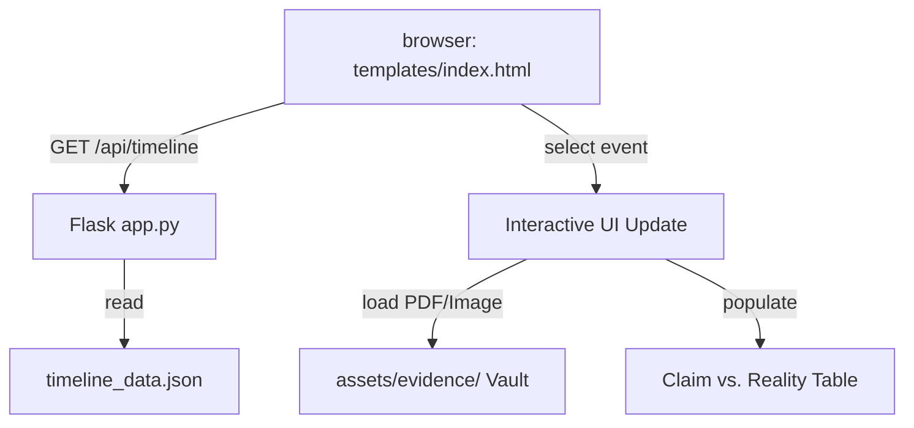

# Architecture & Narrative

The Balbodhini Pathshala Inquiry Portal is engineered around the principles of decoupling, censorship resistance, and simple deployment.

## System Architecture

All textual content, case timelines, and evidence mappings are decoupled from the web presentation layer. This means that adding, editing, or deleting case events does not require modifying the frontend HTML code.

### Core Components
1. **Frontend (`templates/index.html`)**: A slate-dark legal portal styled with Tailwind CSS. It asynchronously fetches the case database on load, sorts events chronologically, and updates the timeline nodes, document viewer, and "Claim vs. Reality" verification tables dynamically.
2. **Backend (`app.py`)**: A lightweight Flask server that serves the frontend template, exposes the timeline database via the `/api/timeline` JSON API endpoint, and exposes the assets vault via dynamic route mapping (`/assets/evidence/<path:filename>`).
3. **Database (`timeline_data.json`)**: The single source of truth containing portal metadata and the case events array.
4. **Evidence Vault (`assets/evidence/`)**: Secure local storage containing redacted PDFs, text transcripts, and image scans.

---

## Censorship Resistance & Physical Jurisdiction

A key design requirement for this portal is hosting immunity against local censorship actions:
* **Offshore Physical Hosting**: The application is deployed on Google Cloud Run in the `us-central1` (Iowa, USA) or `europe-west1` (Belgium, Europe) regions. 
* **Autoscaling to Zero**: To maintain cost efficiency and defend against Denial of Service (DDoS) attacks, the service is configured to autoscale to 3 instances when idle, resulting in a baseline maintenance cost of **$0.00/month**.